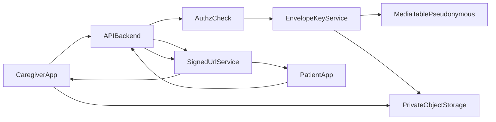

# MemoryLane Backend

NestJS backend for caregiver/patient management, authentication, and secure media handling.

## Why This Security Design

For the bachelor project scope, we selected **Option 2 (Balanced Academic-Grade)** for caregiver media uploads:

- private object storage with signed URLs
- server-side envelope encryption (per-file data key)
- pseudonymous media records to reduce direct caregiver/patient linkage risk

This option gives a strong, defendable security model without the delivery risk of full end-to-end cryptography.

## Decision Record: Options and Tradeoffs

### Option 1: Single key encryption (not chosen)

**Pros**
- fastest implementation
- low infrastructure overhead

**Cons**
- single-key compromise can expose all files
- weaker argument against large-scale breach impact
- less realistic architecture for future scaling

### Option 2: Envelope encryption + private object storage (chosen)

**Pros**
- per-file data keys reduce blast radius
- protects confidentiality even under DB leaks
- aligns with production patterns (signed URLs, private bucket, short-lived access)
- feasible in course timeline

**Cons**
- more components to build and test
- key wrapping/unwrapping logic must be carefully implemented

### Option 3: Client-side end-to-end encryption (not chosen)

**Pros**
- strongest privacy guarantees in theory

**Cons**
- requires complex key lifecycle (sharing, recovery, rotation, device transfer)
- high implementation and debugging cost for bachelor timeline

## Threat Model

Primary threats considered:

- database exfiltration
- object storage misconfiguration or leak
- guessed/reused direct media links
- insecure query paths (SQL injection)

Security objective:

- a database leak should not let an attacker directly map clear media to caregiver/patient identities

## Architecture (Chosen)

### Upload flow

1. Caregiver requests upload intent for a specific patient.
2. Backend verifies caregiver-to-patient authorization.
3. Backend creates:
   - pseudonymous `mediaId`
   - random object key (non-guessable)
   - random file data key (DEK)
   - wrapped DEK (encrypted by master key)
4. Backend stores only metadata + wrapped DEK in DB.
5. Backend returns short-lived signed PUT URL.
6. App uploads encrypted media payload to private storage.

### Read flow

1. Patient/caregiver requests media access.
2. Backend verifies access rights.
3. Backend resolves media by pseudonymous ID.
4. Backend issues short-lived signed GET URL (or streams decrypted content if needed by product design).

## Data Minimization and Unlinkability

To reduce direct linkability in case of DB leak:

- avoid exposing direct caregiver/patient identifiers in media retrieval APIs
- store external-facing opaque IDs (`mediaId`) instead of predictable storage names
- keep relation lookup gated server-side (authorization required)
- never expose permanent public object URLs

Note: complete unlinkability is impossible in relational systems that need access control, but pseudonymization + strict API mediation significantly increases attacker effort.

## Encryption Model

- Use `AES-256-GCM` for media payload encryption (integrity + confidentiality).
- Generate a random DEK per media object.
- Wrap each DEK using a backend master key (or KMS-managed key).
- Store `{ wrappedDek, keyVersion, iv/nonce, authTag, algorithm }` in metadata.
- Keep master key outside source code and outside the database.

## SQL Injection Posture

Current backend stack uses Prisma ORM and typed query builders. This is our baseline defense:

- no dynamic string-concatenated SQL in normal paths
- keep using Prisma typed methods for CRUD and relations
- if raw SQL is required later, use parameterized Prisma raw APIs only
- validate all DTO input and enforce authorization checks for every media route

## Operational Security Requirements

- `JWT_SECRET` and encryption master key must be strong and environment-managed.
- no default fallback key in production.
- signed URLs must be short-lived and scoped to exact object + operation.
- log only pseudonymous IDs (never keys, plaintext names, or raw media payload).
- apply upload limits (size, MIME allow-list) and rate limits.

## Project-Scope Implementation Targets

Within bachelor timeline, implementation should include:

- secure upload intent endpoint
- encrypted media metadata persistence
- private storage integration with signed URLs
- authorization checks for caregiver/patient access
- minimal audit logging around upload/read operations
- focused tests for authz, link expiration, and key metadata correctness

## Local Development Notes

Use environment variables for all secrets and storage configuration. Do not commit real keys or credentials.

Typical categories:

- database connection
- JWT signing secret
- encryption master key (or KMS config)
- object storage endpoint, bucket, access key, secret key
- signed URL expiration durations
- AWS Rekognition credentials for strict QUIZ photo face verification

### QUIZ photo face verification

QUIZ photo uploads are checked with AWS Rekognition before the raw image is encrypted and stored. The service enforces one detected face, front-facing pose, high confidence, and basic clarity thresholds. If the face is small in the frame, the backend crops the accepted image to a square headshot with Sharp before encryption.

Required AWS environment variables:

- `AWS_REGION`
- `AWS_ACCESS_KEY_ID`
- `AWS_SECRET_ACCESS_KEY`

Optional threshold tuning:

- `QUIZ_FACE_MIN_CONFIDENCE`
- `QUIZ_FACE_MIN_SHARPNESS`
- `QUIZ_FACE_MIN_BRIGHTNESS`
- `QUIZ_FACE_MAX_YAW`
- `QUIZ_FACE_MAX_ROLL`
- `QUIZ_FACE_MIN_AREA_BEFORE_CROP`

## Summary

Option 2 is the best fit for this project:

- meaningful security improvements over single-key baseline
- practical complexity for bachelor course constraints
- clear, report-friendly rationale for design decisions and threat mitigation
